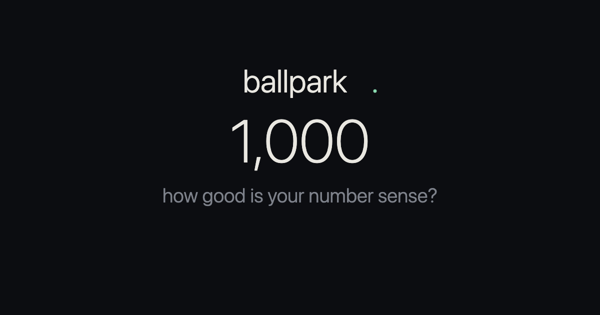

# ballpark

> A minimalist game of numerical intuition.

A number appears above a line. Click where you think it lands. Your score is how
far off you were, as a percentage of the range. Chase **perfect**, keep a streak
alive, come back for the daily.

**[▶ Play it](https://ballpark.pages.dev)** · no install, no sign-up, works in any browser.



---

## Modes

| Mode | What you do |
| --- | --- |
| **classic** | Place the number on a `0 → N` line. |
| **world** | Place a real-world fact (Moon distance, Everest height, year the Berlin Wall fell…). The answer reveals after you guess. |
| **invert** | Classic, but the scale is flipped — max on the left, 0 on the right. |
| **reverse** | The marker is shown; you type the number it points to. |
| **survival** | One miss ends the run. How long can you last? |
| **daily** | 5 fixed rounds, the same set each day. Wordle-style emoji share + a day streak. |

Each estimation mode has **easy / normal / hard** difficulty (wider/tighter
ranges, stricter grading) and keeps its own best / average / streak / rounds.

## Features

- **Daily challenge** — 5 date-seeded rounds, identical for anyone playing the
  same calendar day. Shareable emoji grid, a 🔥 day streak, a "played today"
  badge, and a countdown to the next one at your local midnight.
- **Share** — copy a one-line score, or (on daily) generate a PNG result card via
  the native share sheet, with a download fallback.
- **Light + dark theme** — syncs the browser `theme-color`.
- **Per-mode stats** — everything persists locally; nothing leaves your device.
- **Self-checking** — a built-in smoke test exercises every mode on load; any
  failure shows a loud banner instead of a silently dead page.

## Run locally

It's a single static file — no build, no dependencies.

```sh
open index.html            # macOS: open directly
# or serve it:
python3 -m http.server     # then visit http://localhost:8000
```

Append `?smoke=1` to the URL to run the self-test and log the result to the console.

## How it works

- **`index.html`** — the entire app. Inline CSS + JS, zero dependencies.
- **Scoring** is a pure module: a round is `{ min, max, answer, invert }`, and the
  line ↔ value mapping plus grading live in one place — both the click path and
  the reverse-input path go through it.
- **Modes** are a registry table (`VARIANTS`); adding one is a single row plus a
  `<select>` option, not a new branch in every function.
- **Daily** seeds a `mulberry32` PRNG from the player's **local calendar day**, so
  the round set rolls over at local midnight and the countdown matches the clock
  on your wall. (Players in different time zones therefore see each day's set
  shifted by their offset — by design, to keep the countdown honest.)
- **State** persists in `localStorage`, namespaced `ballpark.*`, separate per mode.
- **`favicon.svg`** — line-and-marker mark. **`og-image.png`** — 1200×630 social card.

## Deploy

Any static host works. This repo deploys to **Cloudflare Pages**: framework
*None*, no build command, output directory `/`. The share URL uses
`location.origin` at runtime; the `https://ballpark.pages.dev` fallback only
shows up when the file is opened locally.

## Credits

A fork of the **eyeball** estimation game — rebuilt and extended with the modes,
daily challenge, theming, and stats above. Built by
[kazani](https://farcaster.xyz/kazani).
